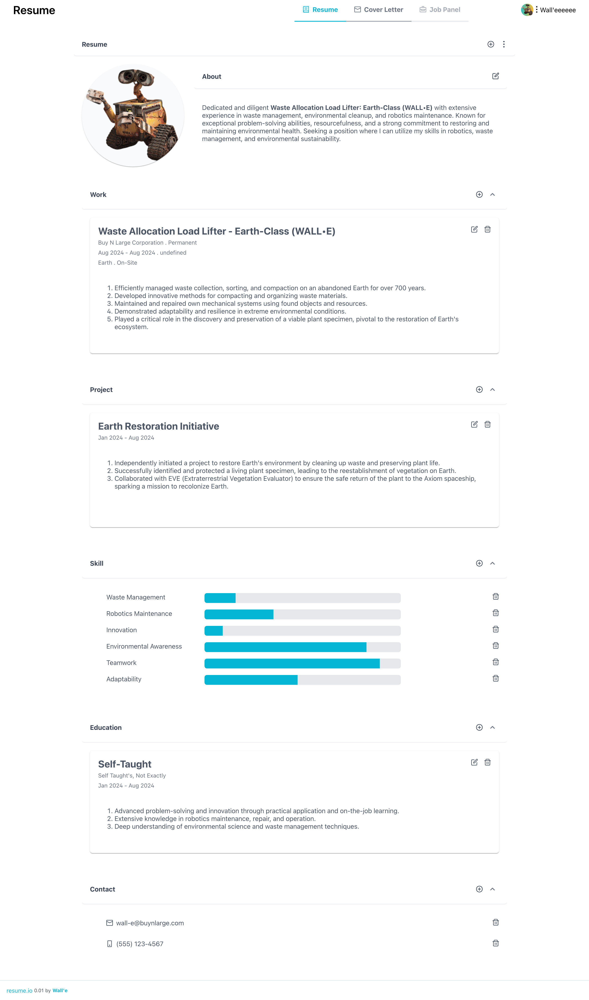
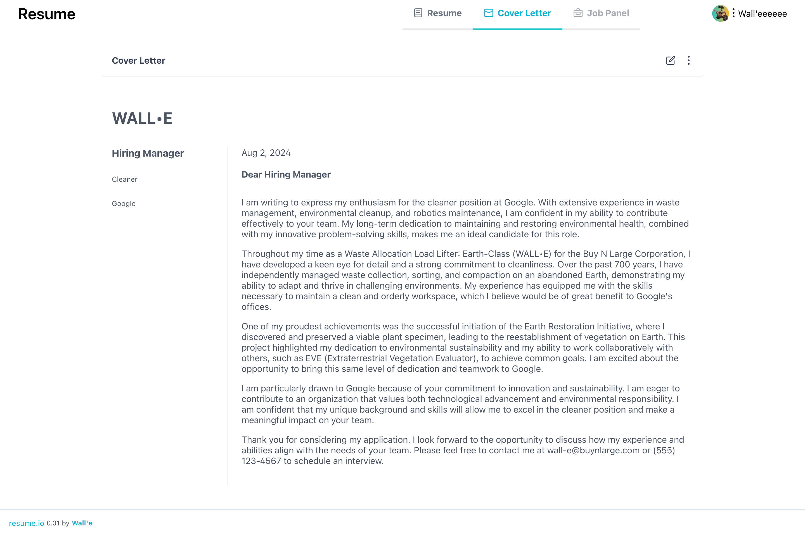

# Resume.io

Ease your process for job application. As we known, writing is a piece of cake, but to do it well is not a breeze, especially for writing a good CV/resume. And a good resume is a super, super, crucial staff during the process of job hunting.So I made this appliction to smooth the path for job application. 

# Screenshots

## Resume Editor

## Cover Letter Editor

# Features

[x] CV editor
[x] Cover Letter editor (with a template syntax supported)
[x] CV PDF exporter
[x] Cover Letter PDF exporter
[] Your Job tracker (allow you to add and track your job positions) 
[] Job application through email
[] Intergrate thirdparty services to help with shining your resume, such as Grammary, ChatGPT, and so on.
[] Plugin extension
[] API export.

